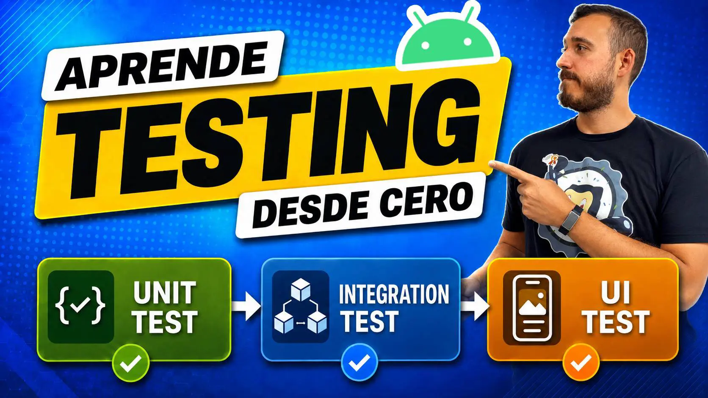

# Masterclass Testing Android: App de Notas 📝✅

<p align="center">
<a href="https://youtube.com/live/89-5NTU90fE"></center></a></p>

<p align="center"> 
 


</p>

Proyecto base para una **masterclass de testing en Android**: una app de notas pequeña pero realista sobre la que se construyen los **tres tipos de test** —unitarios, de integración y de UI— con Kotlin, Jetpack Compose y Room.

La idea: ver lo **rápido, potente y accesible** que es testear una app real, de lo más simple a lo más jugoso.

---

## 🌿 Ramas

El repo está pensado para seguirse en directo. Tienes dos puntos de partida:

| Rama | Qué contiene | Para qué |
|------|--------------|----------|
| **`inicio`** | La app **con un bug sembrado** y **sin ningún test** (las dependencias de testing ya están listas). | Punto de partida: aquí escribes los tests en vivo. |
| **`solucion`** (= `main`) | La app **con el bug arreglado** y **todos los tests** en verde. | El resultado final / referencia. |

> 🐛 **El bug del directo:** en `inicio`, `GetNotesSummaryUseCase` calcula el porcentaje de notas importantes con **división entera** (`important * 100 / total`). Con 2 de 3 notas importantes muestra **66 %** en vez de 67 %. Un test parametrizado lo caza al instante.

```bash
git checkout inicio     # empezar desde cero
git checkout solucion   # ver el resultado
```

---

## 🧪 Los tres tipos de test

| Tipo | Dónde | Qué prueba | Herramientas |
|------|-------|------------|--------------|
| **Unitario** | `app/src/test` | `ValidateTitleUseCase` y `GetNotesSummaryUseCase` (**parametrizados**) y `NotesViewModel` | JUnit4, **MockK**, **Turbine**, coroutines-test |
| **Integración** | `app/src/androidTest` | `NoteDao` sobre una base de datos **Room en memoria** | Room testing, AndroidJUnit4 |
| **UI** | `app/src/androidTest` | El composable `NotesContent` con estados controlados (render + interacción) | **Compose UI Test** (`createComposeRule`) |

---

## ▶️ Cómo ejecutar los tests

| Tipo | Comando |
|------|---------|
| **Unitarios** (JVM, sin dispositivo) | `./gradlew testDebugUnitTest` |
| **Integración + UI** (emulador/dispositivo) | `./gradlew connectedDebugAndroidTest` |

---

## 🏗️ Estructura

```
app/src/main/java/com/aristidevs/masterclass/
├─ MainActivity.kt                 # Wiring manual (sin DI): BD, repositorio y ViewModel
├─ notes/
│  ├─ data/                        # Note, NoteDao, NotesDatabase, RoomNotesRepository
│  ├─ domain/                      # ValidateTitleUseCase, GetNotesSummaryUseCase, NotesRepository
│  └─ ui/                          # NotesScreen (Compose), NotesViewModel
└─ ui/theme/                       # Tema Material 3
```

Arquitectura **Clean Architecture ligera** (data / domain / ui), una sola pantalla, sin inyección de dependencias para que todo el cableado sea visible.

---

## 🧰 Stack

Kotlin · Jetpack Compose · Room · Coroutines/Flow · JUnit4 · MockK · Turbine · Compose UI Test


----------

## 🚀 AppCademy.dev

<p align="center">
<a href="https://appcademy.dev"></center></a></p>

Este curso está patrocinado por [AppCademy.dev](https://appcademy.dev) mi plataforma de cursos premium donde no solo aprendemos tecnologías sino que profundizamos en sus desarrollos a través de buenas prácticas y contenido avanzado.

----------